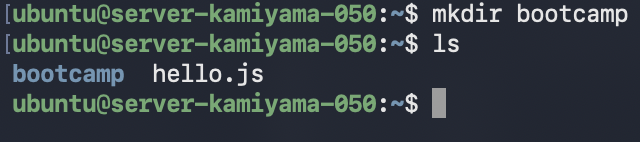
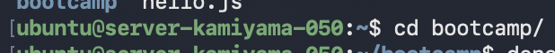
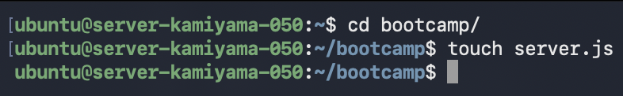
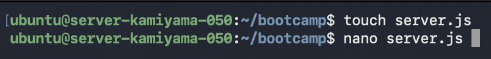
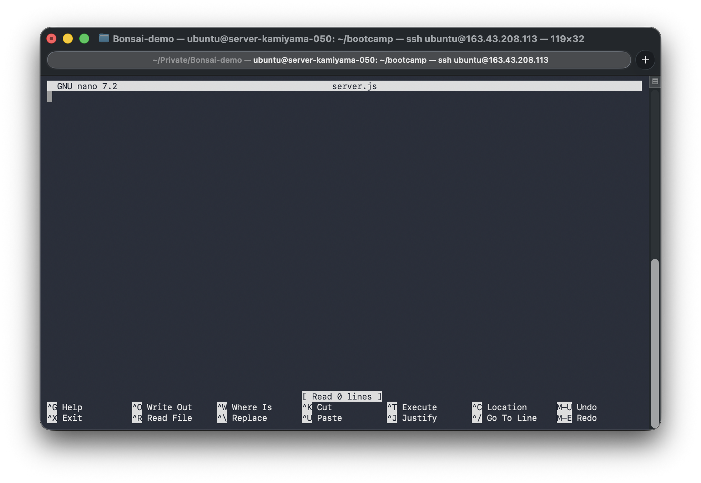

##### 15コマ集中講義 ITブートキャンプ Part10

# サーバープログラム

###### 神山まるごと高専 モノラボ・電気電子系授業担当</br>山地駿徹（やまちゃん） @haruyuki_16278


<!--
こんにちは、今年から神山まるごと高専の教員になりました、山地です。
今回はサーバープログラムについて1コマ、ITブートキャンプの枠で授業をしたいと思います。
-->

---

# Q. サーバーとは

<!--
皆さんサーバーって聞いてなにを思い浮かべますか？
そもそもサーバーってどういうものでしょうか。

ゲームのサーバーが落ちてゲームができなくなった。Twitterのサーバーが落ちて投稿を見れなかった。というような経験が皆さんあるのでは無いでしょうか？

このサーバーというのは、何なんでしょう。
-->

---

## A. 別のコンピューターから</br>要求されたデータを提供する</br>コンピューター

<!--
答えは別のコンピューターから要求されたデータを提供するコンピューターです。

どういうことかわからないですよね。
もう少し例を出して見てみましょう。
-->

---


<!--
このような形で、みんなが使っているアプリや、遊んでいるゲームは、サーバーにデータを要求して、そのデータを使って画面の表示や機能の処理を行っています。
-->

---


<!--
例えばツイッターのアプリを開いて最初の表示を出すとき。

1. アプリがサーバーに「最初の表示を出すためのデータをください」と要求する
2. サーバーがデータベースからデータを取得して、アプリに返す
3. アプリがデータを使って画面を表示する
というような流れになっています。
-->

---

## A. 別のコンピューターから</br>要求されたデータを提供する</br>コンピューター

<!--
これが「別のコンピューターから要求されたデータを提供するコンピューター」です。
-->

---

# Q. どんなときに必要？

<!--
では、どんなときにサーバーが必要になるでしょうか？ 
-->

---

## A. データを保存・共有したいとき

<!--
答えは、データを保存したり共有したりしたいときです。
さっきの例で言うならツイート。どこで保存すればいいでしょうか？
スマホに保存してほかの人から見れるでしょうか。
-->

---


<!--
見れませんよね。
ではサーバーに保存しておくようとどうでしょうか。

Aさんのツイートをサーバーを通してデータベースに保存することを考えます。
-->

---


<!--
サーバーはスマートフォンやPCのように個人に紐づくものではなく、アプリケーションに紐づいてデータを取得できるようにします。

ここで、BさんがTwitterアプリを開いてタイムラインを表示しようとするとどうなるでしょうか？
Twitterアプリはサーバーに表示するべきツイートを要求できます。
サーバーは要求に答え、データを準備してツイートをアプリに提供します。

このようにしてアプリ上でツイートを確認できるようになります。
-->

---

## A. データを保存・共有したいとき

<!--
データを保存し・共有したいときにはサーバーを用意しましょう。
-->

---

# 触ってみよう！

<!--
とはいえ、お固めの説明を聞いてるだけではわからないですよね？
実際に触ってみましょう。
-->

---


<!--
こちらのロゴ、皆さんおわかりですね。
-->

---


<!--
こちらのロゴはどうでしょうか。

なんと、今回このITブートキャンプのためだけに、さくらインターネットさんのご協力で一人1台サーバー用コンピューターをお借りすることができました！

皆さんには昨日（2026/04/09）のうちにClassroomを通じてサーバーへのログイン情報を送ってあります。
まずは送ったメッセージに従って、シングルサーバコントロールパネル にログインしてみましょう。
-->

---

[シングルサーバーコントロールパネル](https://secure.sakura.ad.jp/cloud/single/)を開きログイン


---

ログイン後の画面


---

右上にある電源操作を探してクリック→起動をクリック


---

OK


---

ステータスが変わって起動中...


---

起動したらNICのタブに切り替えてIPv4アドレスをコピー


---

トラックパッドで4本指ピンチイン or cmd + space で
terminal と入力、ターミナルを開く


---

`ssh ubuntu@<コピーしたIPアドレス>` と入力してEnter
→ `yes` と入力してEnter
→ パスワードを入力してEnter


---

↓まで来たらOK!


---

# 遠くにあるコンピューターにつながった！

<!--
ここまでで、遠くにあるコンピューターにログインすることができました。

では実際にこのコンピューターにサーバーの役割をもたせるプログラムを実装していきましょう。
-->

---

# 今回は...

---


## Deno

<!--
今回はDeno(ディーノ)というJavaScriptのランタイムを使ってサーバープログラムの開発を体験してもらおうと思います。

JavaScriptはWebページで動くプログラムとして有名ですが、サーバープログラムとして動かすこともできます。
-->

---

 <https://deno.com> 中頃にあるコマンドをコピー


<!--
まずはDenoをインストールするため、スライドのURLをブラウザで開いてください。

ページ中頃までスクロールしたらインストール用のコマンドが出てきます。
これをコピーして、サーバーにログインしているターミナルで実行します。
-->

---


「PATHにDenoを追加するために</br>ターミナルの設定変更していい？」
→ y を入力してEnter

---


「ターミナル上での補完を有効にする？」
→ y を入力してEnter

インストールが終了したら `sudo reboot` を実行して</br>一度サーバーを再起動

---

## 覚えてるかな？

もう一度ターミナルからサーバーに `ssh` で接続しよう

---

# Denoを動かしてみよう

---

## JavaScript

<!--
JavaScript という名前を聞いたことがある人はいますか？
JavaScriptはブラウザ上で動くスクリプト言語を求めて1995年に開発された言語で、現代に置いてもWebアプリで活発に利用されています。
その後2009年にNode.jsが誕生し、サーバープログラムでもJavaScriptが利用されるようになりました。

現在ではJavaScriptをサーバーで動かす仕組みはNode.jsだけではありません。
Denoもその一つです。

一旦今回大事なのは、今からサーバープログラムをJavaScriptで書く、ということです！
-->

---

## Hello,World! on Deno

`deno`と打ってDenoを起動して、</br>
`console.log("Hello, World!");` と入力してEnter


<!--
ここまででDenoのインストールが終わっているので、Denoを利用したHello, World!を実行しましょう。

スライド通り
-->

---

# ソースコードで動かそう

<!--
これでターミナルからDenoを利用してJavaScriptを実行できました。
でも、これだといろんな処理をさせるためにわざわざターミナルから手入力でコードを実行することになります。
これでは困ってしまうので、ソースコードをファイルに書いて、それを実行するようにしましょう。
-->

---

ターミナルで `nano` と入力してEnter


---

ハローワールドを入力して、</br>`ctrl` + `o` で保存、enter、</br>`ctrl` + `x` で終了
ファイル名は `hello.js`


---

`deno run hello.js`


---

# サーバーを作ろう！

---

まずはコードを保存しておくディレクトリを作りましょう
`mkdir bootcamp`



`cd bootcamp` で作ったディレクトリの中に移動



---

`touch server.js` で編集するためのファイルを作成



`nano server.js` で編集



↓



---

# 静的ファイルのホスティング

<!--
まずはHTMLファイルなど、用意されたファイルをそのまま返す「静的ファイルホスティング」をやってみましょう。
-->

---

`server.js`に以下の内容を入力してください。
</br>
```js
import { serveDir } from "jsr:@std/http/file-server";

Deno.serve((req) => serveDir(req, { fsRoot: "static" }));
```

<!--
`Deno.serve` はリクエストを受け取ってレスポンスを返す関数を登録します。
ここでは、リクエストされたパスに従って `static` フォルダの中のファイルをそのまま返す `serveDir` という機能を使っています。
-->

---

`bootcamp`ディレクトリの中に</br>`static`ディレクトリを作成
その中に `index.html` というファイルを作ります
</br>

`mkdir static`
`nano static/index.html`

```html
<!DOCTYPE html>
<html>
  <body>
    <h1>Hello Deno Serve!</h1>
  </body>
</html>
```

---


動かしてみよう！

`deno run --allow-net --allow-read server.js`

ブラウザで </br>`http://<サーバーのIPアドレス>:8000/` にアクセス！

表示されたかな？

---

# APIの作成

<!--
つぎは、単にファイルを返すだけでなく、プログラムに処理を書いてデータをやり取りする「API」を作ってみましょう。
-->

---

一度 `ctrl` + `c` でサーバーを停止してから、
`server.js` を次のように書き換えます

```js
Deno.serve((req) => {
  const url = new URL(req.url);

  if (url.pathname === "/api/hello") {
    return new Response("Hello API!");
  }

  return new Response("Not Found", { status: 404 });
});
```

---

再び `deno run --allow-net server.js` で起動し、
ブラウザで </br>`http://<サーバーのIPアドレス>:8000/api/hello` にアクセスしてみましょう

文字が表示されれば成功です！

---

# チャットアプリを作ろう！

<!--
これまでの知識を組み合わせて、簡単なチャットアプリ（BBS）を作ってみましょう！
ベースとなるのは福野さんの作られた `bbs_deno` というアプリです。
-->

---

`static/index.html` を編集して、見た目を作ります

```html
<!DOCTYPE html>
<html>
<head>
  <meta charset="utf-8">
  <link rel="stylesheet" href="https://unpkg.com/sakura.css/css/sakura.css">
</head>
<body>
  <h1>チャットアプリ</h1>
  <div id="container"></div>

  <div style="border: 1px solid gray; padding: 1em;">
    名前：<input type="text" id="inp_name"><br>
    本文：<input type="text" id="inp_body"><br>
    <button id="btn_write">書き込む</button>
  </div>
  
  <script type="module" src="./main.js"></script>
</body>
</html>
```

<!--
htmlには入力欄と書き込みボタン、そして過去の書き込みを表示するコンテナを用意します。
また、見た目を少し整えるために sakuracss という軽量なスタイルを追加しています。
-->

---

`nano static/main.js` でファイルを作成し、
画面の機能を作ります

```js
const load = async () => {
  const res = await fetch("/api/list");
  const data = await res.json();
  container.innerHTML = "";
  for (const d of data) {
    container.innerHTML += `<div>${d.name}: ${d.body}</div><hr>`;
  }
};

btn_write.onclick = async () => {
  const item = { name: inp_name.value, body: inp_body.value };
  await fetch("/api/add", { method: "POST", body: JSON.stringify(item) });
  inp_body.value = "";
  load();
};

load();
```

---

`server.js` を書き換えて、</br>APIと静的ファイルの両方を扱えるようにします

```js
import { serveDir } from "jsr:@std/http/file-server";

const data = []; // 書き込みデータを保存する配列

Deno.serve(async (req) => {
  const url = new URL(req.url);

  if (req.method === "GET" && url.pathname === "/api/list") {
    return Response.json(data);
  }
  if (req.method === "POST" && url.pathname === "/api/add") {
    data.push(await req.json());
    return new Response("ok");
  }

  return serveDir(req, { fsRoot: "static" });
});
```

---

# 動かしてみよう！

`deno run --allow-net --allow-read server.js`

ブラウザで `http://<サーバーのIPアドレス>:8000/` にアクセスして、文字を書き込んでみよう！

複数人で同じURLを開いて、チャットができるか確認してみてください。

<!--
お疲れ様でした！これでサーバープログラムの基本は完了です。
自分で作ったサーバーでデータが共有できる感覚、楽しんでもらえたでしょうか？
-->

---

### 早く終わったら...

カスタマイズしてみよう！

<!--
ただのチャットツールじゃなくて、勝手に投稿内容を書き換えちゃう！？
-->

