##### 15コマ集中講義 ITブートキャンプ Part10

# サーバープログラム

###### 神山まるごと高専 モノラボ・電気電子系授業担当</br>山地駿徹（やまちゃん） @haruyuki_16278


<!--
こんにちは、今年から神山まるごと高専の教員になりました、山地です。
今回はサーバープログラムについて1コマ、ITブートキャンプの枠で授業をしたいと思います。
-->

---

# Q. サーバーとは

<!--
皆さんサーバーって聞いてなにを思い浮かべますか？
そもそもサーバーってどういうものでしょうか。

ゲームのサーバーが落ちてゲームができなくなった。Twitterのサーバーが落ちて投稿を見れなかった。というような経験が皆さんあるのでは無いでしょうか？

このサーバーというのは、何なんでしょう。
-->

---

## A. 別のコンピューターから</br>要求されたデータを提供する</br>コンピューター

<!--
答えは別のコンピューターから要求されたデータを提供するコンピューターです。

どういうことかわからないですよね。
もう少し例を出して見てみましょう。
-->

---

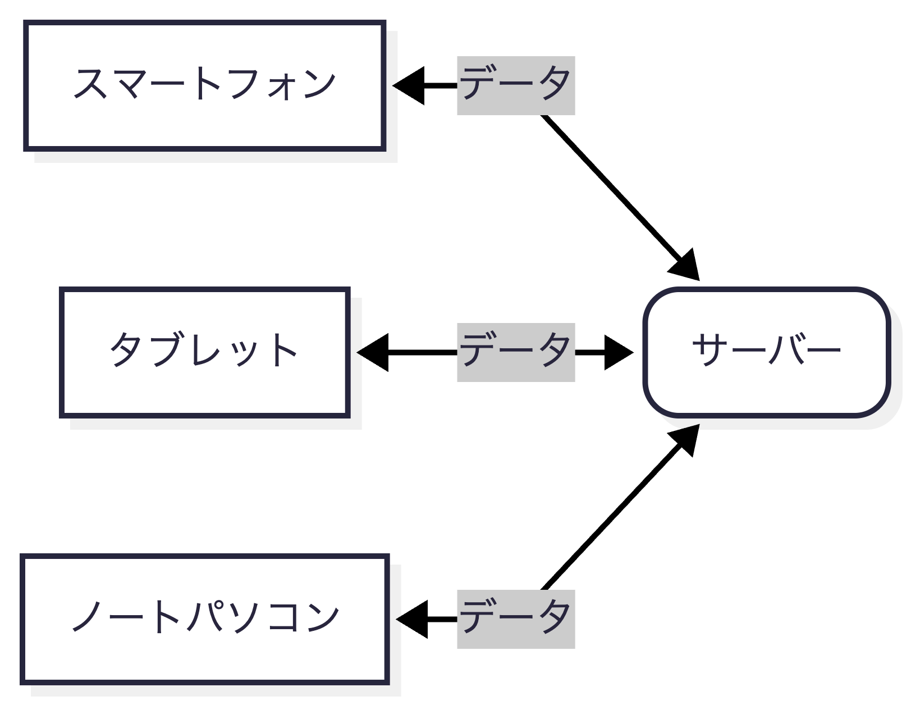

<!--
このような形で、みんなが使っているアプリや、遊んでいるゲームは、サーバーにデータを要求して、そのデータを使って画面の表示や機能の処理を行っています。
-->

---

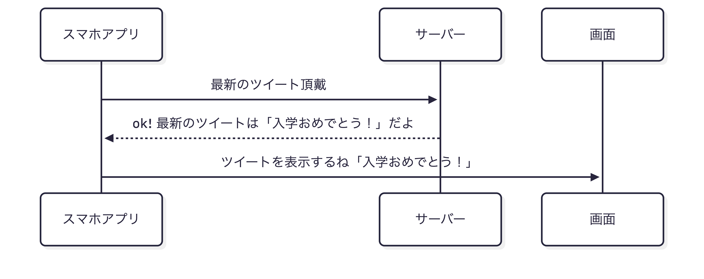

<!--
例えばツイッターのアプリを開いて最初の表示を出すとき。

1. アプリがサーバーに「最初の表示を出すためのデータをください」と要求する
2. サーバーがデータベースからデータを取得して、アプリに返す
3. アプリがデータを使って画面を表示する
というような流れになっています。
-->

---

## A. 別のコンピューターから</br>要求されたデータを提供する</br>コンピューター

<!--
これが「別のコンピューターから要求されたデータを提供するコンピューター」です。
-->

---

# Q. どんなときに必要？

<!--
では、どんなときにサーバーが必要になるでしょうか？ 
-->

---

## A. データを保存・共有したいとき

<!--
答えは、データを保存したり共有したりしたいときです。
さっきの例で言うならツイート。どこで保存すればいいでしょうか？
スマホに保存してほかの人から見れるでしょうか。
-->

---


<!--
見れませんよね。
ではサーバーに保存しておくようとどうでしょうか。

Aさんのツイートをサーバーを通してデータベースに保存することを考えます。
-->

---


<!--
サーバーはスマートフォンやPCのように個人に紐づくものではなく、アプリケーションに紐づいてデータを取得できるようにします。

ここで、BさんがTwitterアプリを開いてタイムラインを表示しようとするとどうなるでしょうか？
Twitterアプリはサーバーに表示するべきツイートを要求できます。
サーバーは要求に答え、データを準備してツイートをアプリに提供します。

このようにしてアプリ上でツイートを確認できるようになります。
-->

---

## A. データを保存・共有したいとき

<!--
データを保存し・共有したいときにはサーバーを用意しましょう。
-->

---

# 触ってみよう！

<!--
とはいえ、お固めの説明を聞いてるだけではわからないですよね？
実際に触ってみましょう。
-->

---


<!--
こちらのロゴ、皆さんおわかりですね。
-->

---


<!--
こちらのロゴはどうでしょうか。

なんと、今回このITブートキャンプのためだけに、さくらインターネットさんのご協力で一人1台サーバー用コンピューターをお借りすることができました！

皆さんには昨日（2026/04/09）のうちにClassroomを通じてサーバーへのログイン情報を送ってあります。
まずは送ったメッセージに従って、シングルサーバコントロールパネル にログインしてみましょう。
-->

---

[シングルサーバーコントロールパネル](https://secure.sakura.ad.jp/cloud/single/)を開きログイン

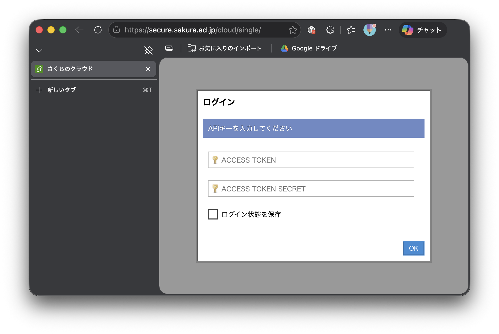

---

ログイン後の画面


---

右上にある電源操作を探してクリック→起動をクリック

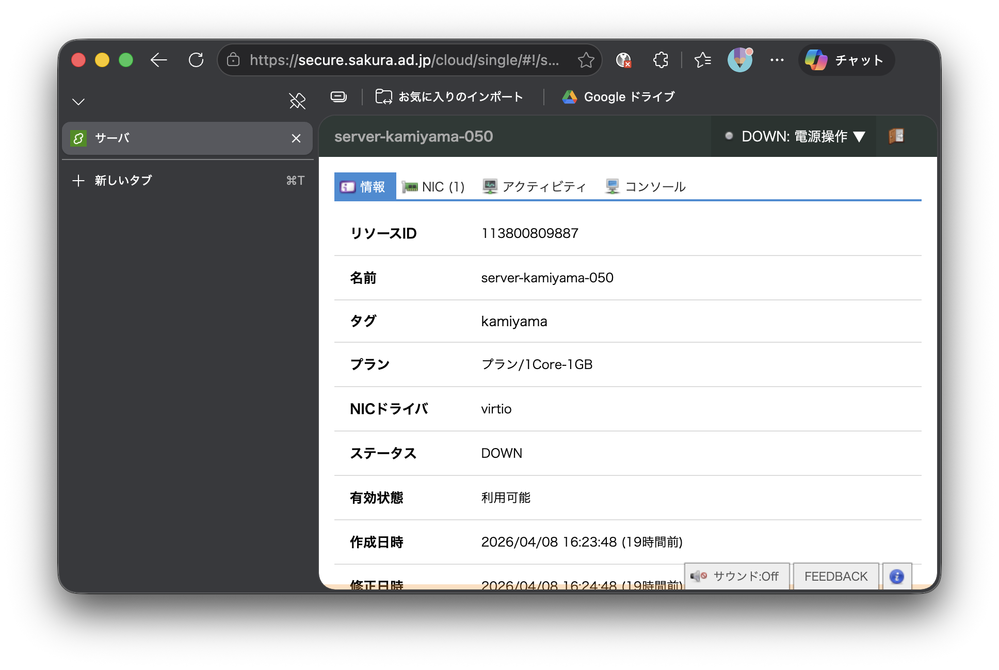

---

OK

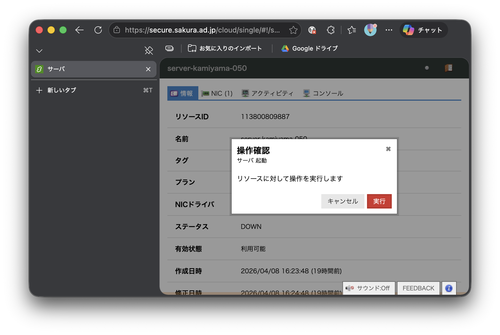

---

ステータスが変わって起動中...

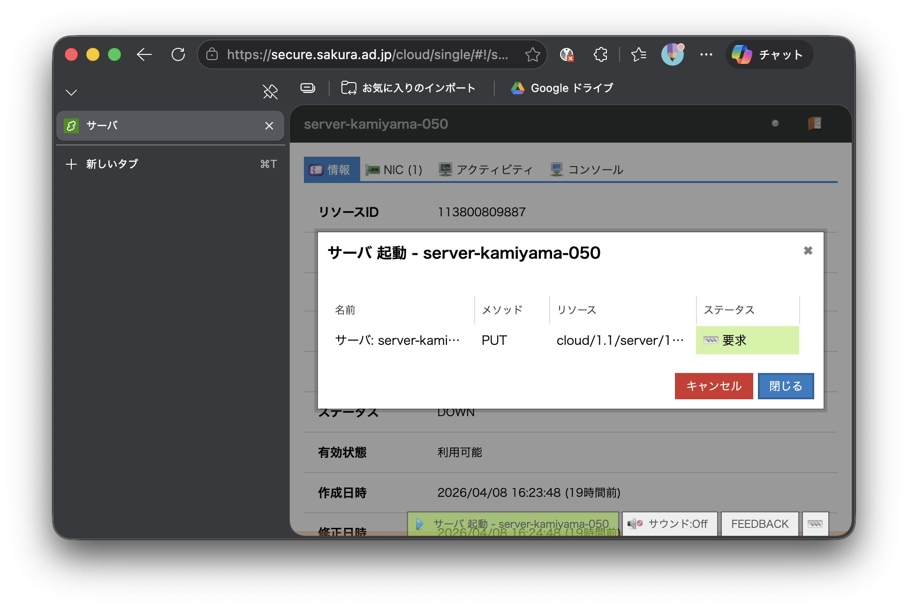

---

起動したらNICのタブに切り替えてIPv4アドレスをコピー

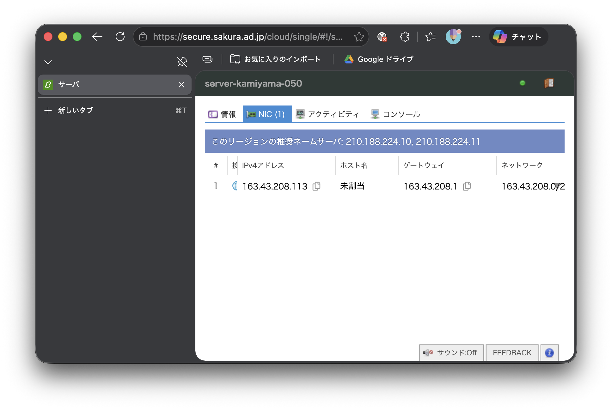

---

トラックパッドで4本指ピンチイン or cmd + space で
terminal と入力、ターミナルを開く

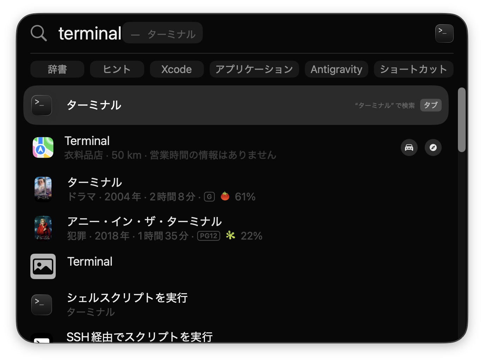

---

`ssh ubuntu@<コピーしたIPアドレス>` と入力してEnter
→ `yes` と入力してEnter
→ パスワードを入力してEnter

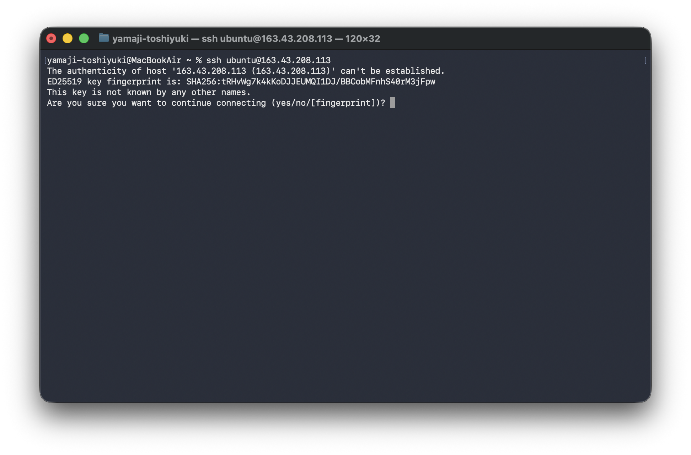

---

↓まで来たらOK!

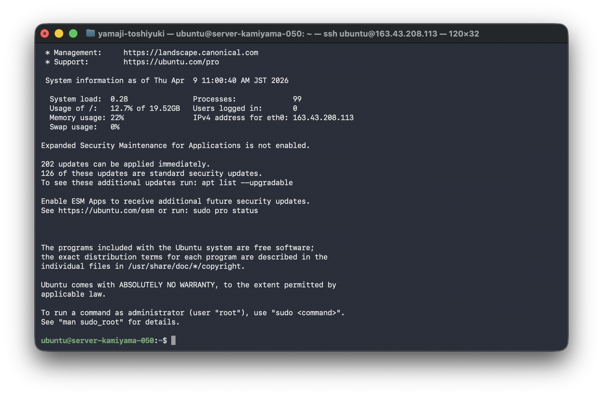

---

# 遠くにあるコンピューターにつながった！

<!--
ここまでで、遠くにあるコンピューターにログインすることができました。

では実際にこのコンピューターにサーバーの役割をもたせるプログラムを実装していきましょう。
-->

---

# 今回は...

---


## Deno

<!--
今回はDeno(ディーノ)というJavaScriptのランタイムを使ってサーバープログラムの開発を体験してもらおうと思います。

JavaScriptはWebページで動くプログラムとして有名ですが、サーバープログラムとして動かすこともできます。
-->

---

 <https://deno.com> 中頃にあるコマンドをコピー

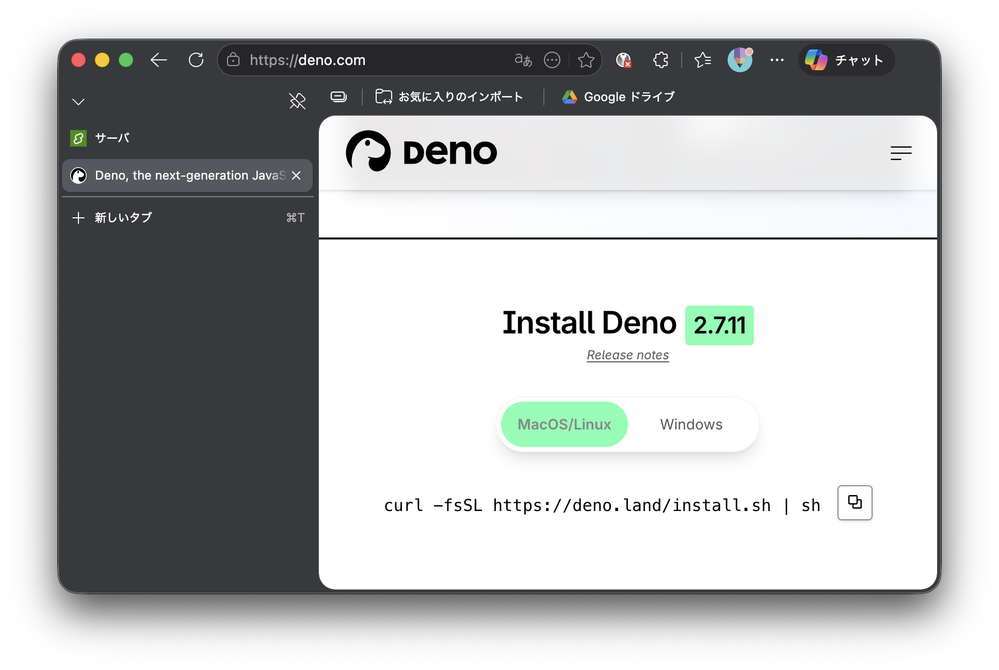

<!--
まずはDenoをインストールするため、スライドのURLをブラウザで開いてください。

ページ中頃までスクロールしたらインストール用のコマンドが出てきます。
これをコピーして、サーバーにログインしているターミナルで実行します。
-->

---

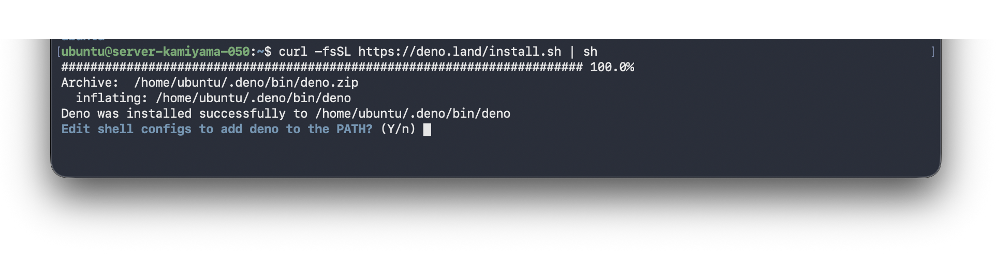

「PATHにDenoを追加するために</br>ターミナルの設定変更していい？」
→ y を入力してEnter

---

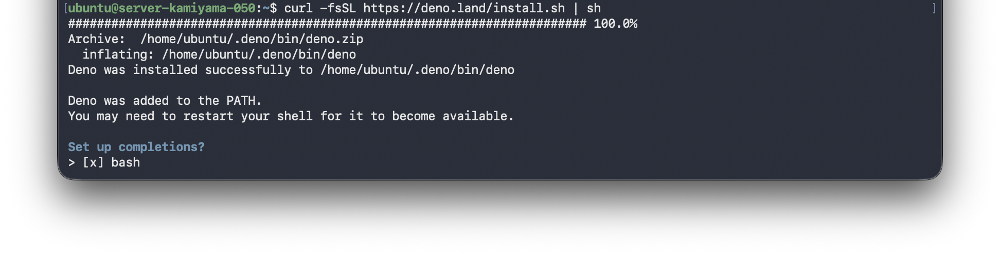
「ターミナル上での補完を有効にする？」
→ y を入力してEnter

インストールが終了したら `sudo reboot` を実行して</br>一度サーバーを再起動

---

## 覚えてるかな？

もう一度ターミナルからサーバーに `ssh` で接続しよう

---

# Denoを動かしてみよう

---

## JavaScript

<!--
JavaScript という名前を聞いたことがある人はいますか？
JavaScriptはブラウザ上で動くスクリプト言語を求めて1995年に開発された言語で、現代に置いてもWebアプリで活発に利用されています。
その後2009年にNode.jsが誕生し、サーバープログラムでもJavaScriptが利用されるようになりました。

現在ではJavaScriptをサーバーで動かす仕組みはNode.jsだけではありません。
Denoもその一つです。

一旦今回大事なのは、今からサーバープログラムをJavaScriptで書く、ということです！
-->

---

## Hello,World! on Deno

`deno`と打ってDenoを起動して、</br>
`console.log("Hello, World!");` と入力してEnter

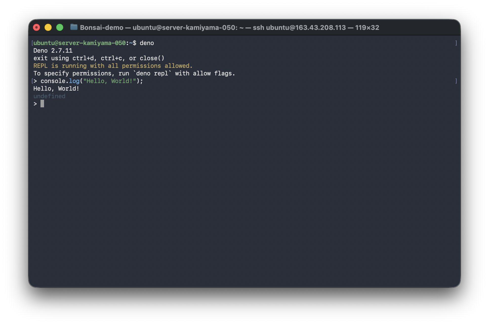

<!--
ここまででDenoのインストールが終わっているので、Denoを利用したHello, World!を実行しましょう。

スライド通り
-->

---

# ソースコードで動かそう

<!--
これでターミナルからDenoを利用してJavaScriptを実行できました。
でも、これだといろんな処理をさせるためにわざわざターミナルから手入力でコードを実行することになります。
これでは困ってしまうので、ソースコードをファイルに書いて、それを実行するようにしましょう。
-->

---

ターミナルで `nano` と入力してEnter

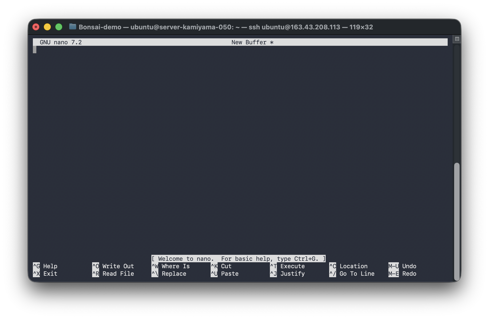

---

ハローワールドを入力して、</br>`ctrl` + `o` で保存、enter、</br>`ctrl` + `x` で終了
ファイル名は `hello.js`

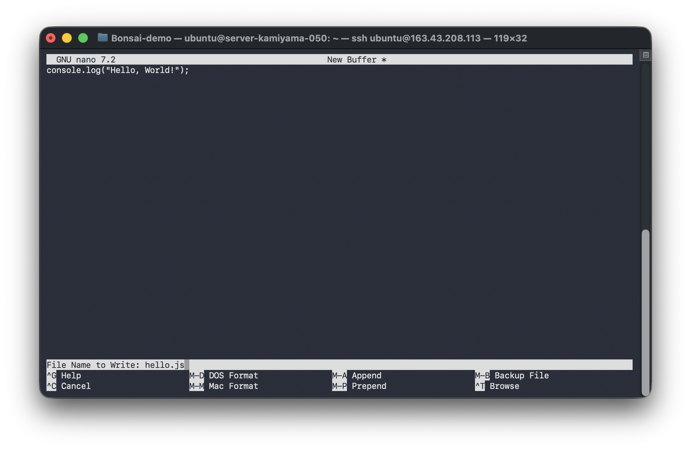

---

`deno run hello.js`

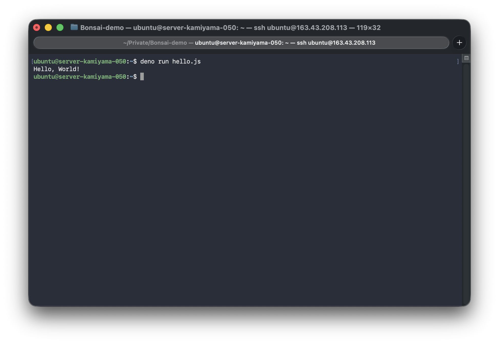

---

# サーバーを作ろう！

<!--
先程はただHello Worldを表示しただけでしたが、次は実際のアプリケーションを動かしてみましょう！
今回は、すでに用意されているチャットアプリのプログラムを使ってサーバーを作ります。
-->

---

# おまじない (git clone)

<!--
1コマ目で皆さんはGitHubを使いましたね。
今回はそのGitHubにある他人のプログラムを自分の手元に持ってくる「git clone」というおまじないを使います。
-->

---

[haruyuki-16278/bootcamp](https://github.com/haruyuki-16278/bootcamp) にアクセスし、
右上の「Fork」ボタンから自分のアカウントにコピーを作ります

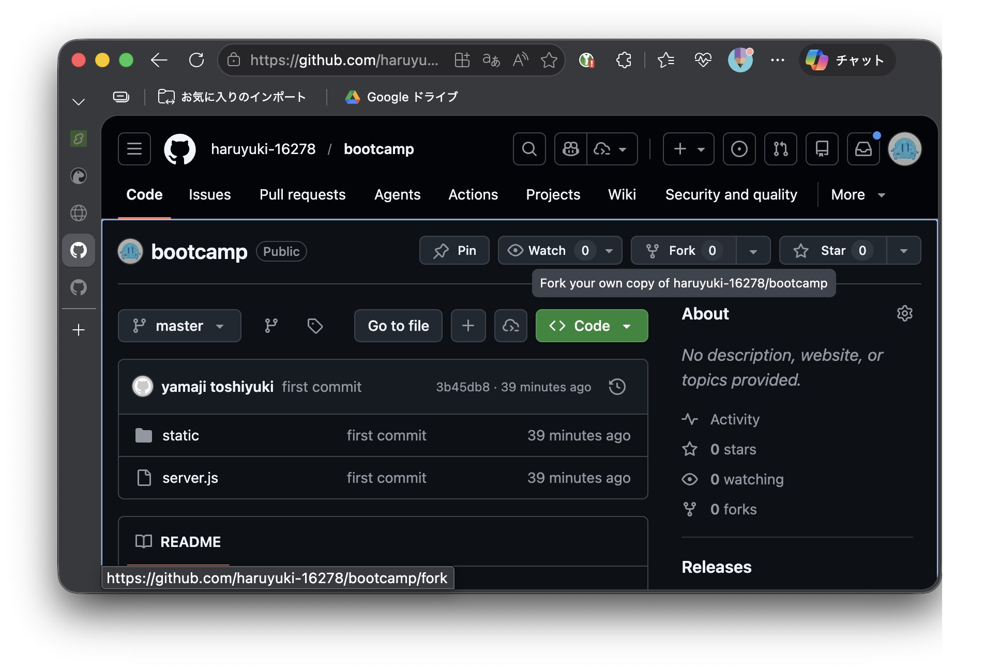

<!--
まずは元となるプログラムを、自分のGitHubアカウントにコピー（Fork）します。
-->

---

Forkした自分のリポジトリページで、
緑色の `<> Code` ボタンを押し、URLをコピーします

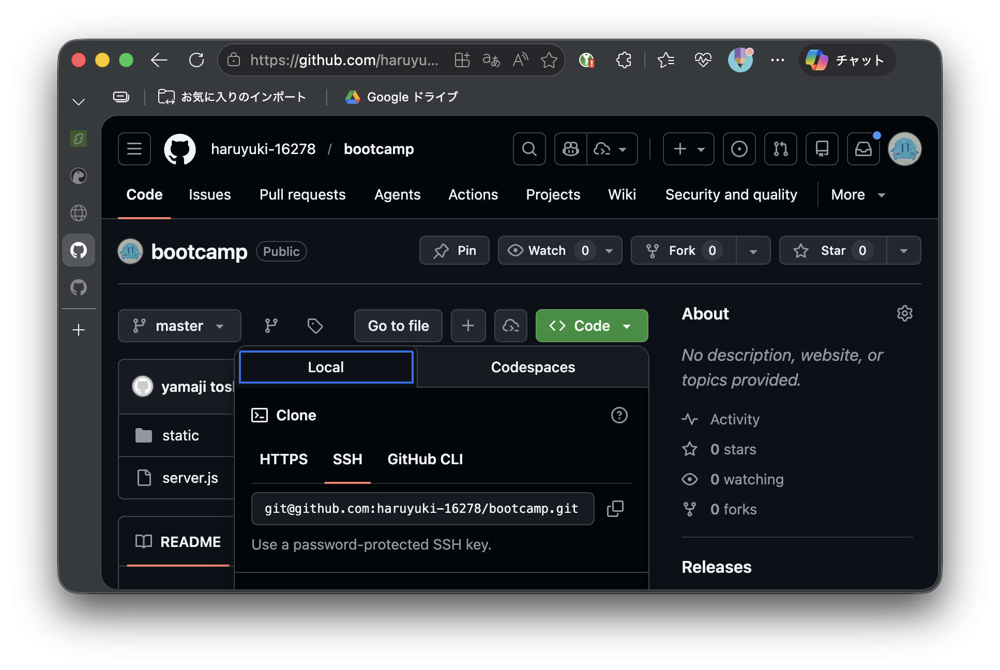

---

サーバーのターミナルで以下のコマンドを実行します

`git clone <コピーしたURL>`

<!--
git cloneコマンドを実行すると、GitHub上にあるプログラム一式が手元のサーバーにダウンロードされます。
-->

---

`cd bootcamp` でダウンロードしたディレクトリに移動し、サーバーを起動します！

`deno run --allow-net --allow-read server.js`

ブラウザで `http://<サーバーのIPアドレス>:8000/` に</br>アクセスしてみよう！

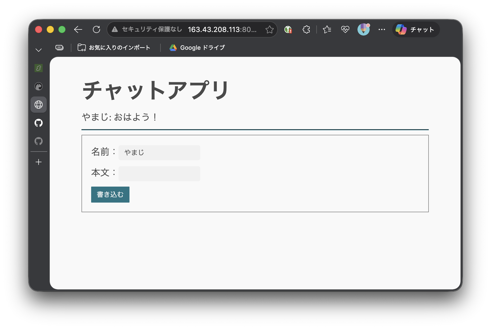

<!--
アプリが開いたら適当に書き込みをしてみてください。複数人で同じIPアドレスにアクセスすると、チャットができるはずです！
-->

---

# 中身はどうなってるの？

<!--
どうしてこのプログラムでブラウザに画面が表示されて、チャットができるのでしょうか？
中身のソースコード（プログラム）を覗いてみましょう。
-->

---

## 1. 静的ファイルのホスティング

<!--
ブラウザでアクセスしたときの「画面」はどこから来ているのでしょうか？
-->

---

ターミナルで一度 `ctrl` + `c` でサーバーを停止してから、
`cat static/index.html` と打って中身を見てみましょう

```html
<!DOCTYPE html>
<html>
<head>
  <meta charset="utf-8">
  <title>DenoでシンプルなBBS</title>
...
```

ブラウザはこのファイルを受け取って画面を描画しています。これを **「静的ファイルホスティング」** と呼びます。

---

## 2. APIの作成

<!--
では、書き込んだデータや過去の投稿は、どうやってやり取りしているのでしょうか？
-->

---

ターミナルで `cat server.js` と打って
サーバー側のプログラムを見てみましょう

```js
Deno.serve(async (req) => {
  const url = new URL(req.url);

  if (req.method === "GET" && url.pathname === "/api/list") {
    return Response.json(data);
  }
  if (req.method === "POST" && url.pathname === "/api/add") {
    data.push(await req.json());
    return new Response("ok");
  }
```

<!--
ここが「API（Application Programming Interface）」と呼ばれる部分です。
`/api/list` にアクセスされるとデータを返し、`/api/add` にデータが送られてくるとそれを保存する処理が書かれています。
-->

---

# お疲れ様でした！

<!--
これでサーバープログラムの基本は完了です。
自分で動かしたサーバーでデータが共有できる感覚、楽しんでもらえたでしょうか？
-->

---

### 早く終わったら...

プログラムをカスタマイズしてみよう！

1. `nano static/index.html` で CSS を書き換えて、見た目をおしゃれにする🖌️
2. 投稿に「いいね！」ボタンを追加する機能を作ってみる👍
3. 投稿内容が勝手に書き換わるジョーク機能を入れてみる！？🤡

<!--
進みの早い人は、ぜひ自分でコードを直接編集して遊んでみてください。
ファイルを書き換えて、再度 deno の起動コマンドを実行し直せば変更が反映されます！
-->
